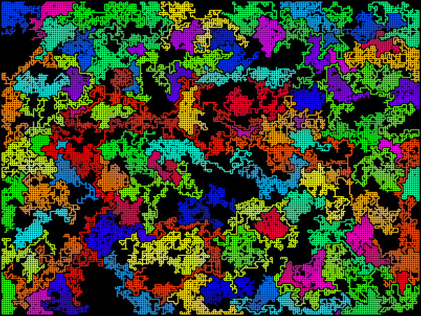
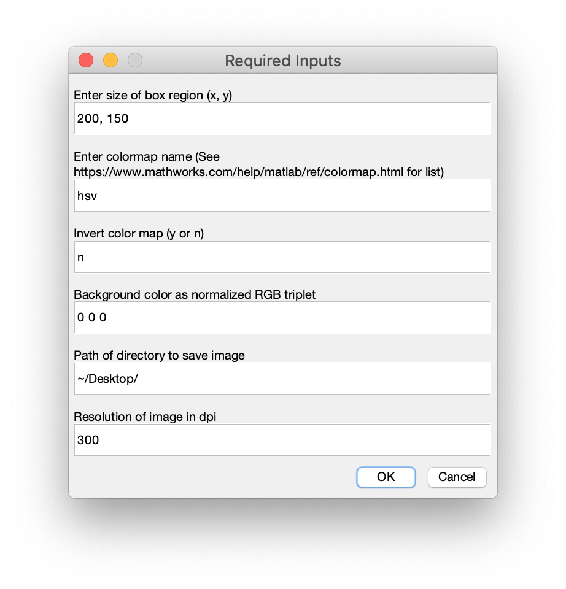

## Description ##
A code to generate an unique .png image of a series of random walks constrained to a box. 
Each walker is required to stay within the box region and cannot walk on locations 
previously walked by other walkers. This allows for clear separation of colors in the 
resulting image. Each walk is uniquely colored based on an input colormap, and therefore 
generates an aesthetically pleasing image. 


Default image


## Installation ##

To install with Unix:
```
cd <install_dir>
git clone https://github.com/kjdoore/Random_Walk_Art.git
```


## Generating an Image ##

To run the code to generate an image, enter the following into a MATLAB command line:
```
addpath('<install_dir>/Random_Walk_Art/')
random_walk_art
```

The following dialog box will open for inputs to be entered.



1. `Enter size of box region (x, y)`: two numbers separated by a comma or space. These 
respective values give the x and y dimensions of the box that the walkers are constrained. 
The larger the box is, the more area the walkers have and the long walkers will walk.
**NOTE***: If this value is exceedingly large (total area > 250,000), then the code may take 
several minutes to generate the image. 

2. `Enter colormap name`: the name of the colormap to use for each walker. A list of native
colormaps can be found [here](https://www.mathworks.com/help/matlab/ref/colormap.html). User
defined colormaps can also be used if they are defined before running.

3. `Invert color map (y or n)`: Inverts the colormap. Colors at the start of the colormap
will likely cover larger areas of the image due to the walkers not being constrained by
previous walkers.

4. `Background color as normalized RGB triplet`: a normalized (max value of 1) RGB triplet
containing the color of the background. Values must be separated by a space or comma.

5. `Path of directory to save image`: the path to the directory that the image will be 
saved.

6. `Resolution of image in dpi`: the resolution of the .png image in dpi (dots per inch). 
High values will result in high resolution images. **NOTE***: Large values (>1000) can 
require several minutes to save the image.

